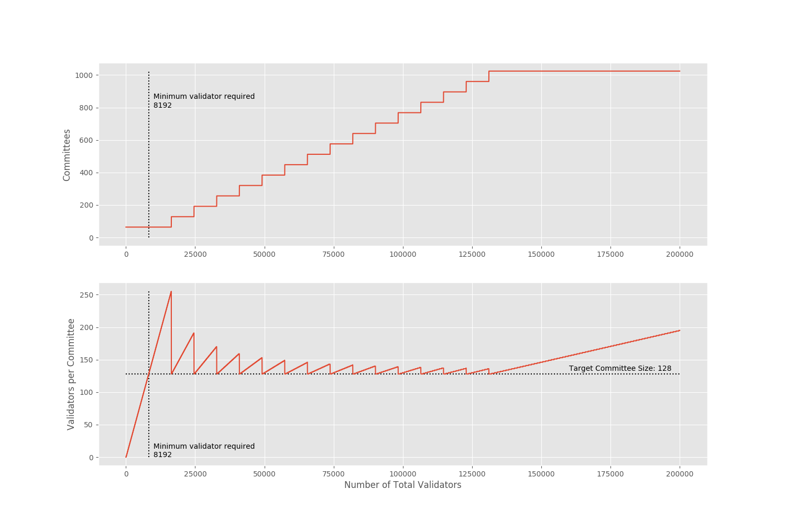

# How many committees are there and how many validators in a committee?



It depends on how many total active validators at the moment.


From spec [v0.8.1](https://github.com/ethereum/eth2.0-specs/blob/v0.8.1/specs/core/0_beacon-chain.md#get_committee_count)

```python
def get_committee_count(state: BeaconState, epoch: Epoch) -> uint64:
    """
    Return the number of committees at ``epoch``.
    """
    committees_per_slot = max(1, min(
        SHARD_COUNT // SLOTS_PER_EPOCH,
        len(get_active_validator_indices(state, epoch)) // SLOTS_PER_EPOCH // TARGET_COMMITTEE_SIZE,
    ))
    return committees_per_slot * SLOTS_PER_EPOCH
```

## Related

- How validators are assigned to the commmittees? See [shuffling](https://github.com/protolambda/eth2-docs#shuffling)
- Why the target committee size is 128? See [minimum committee size explained](https://medium.com/@chihchengliang/minimum-committee-size-explained-67047111fa20)