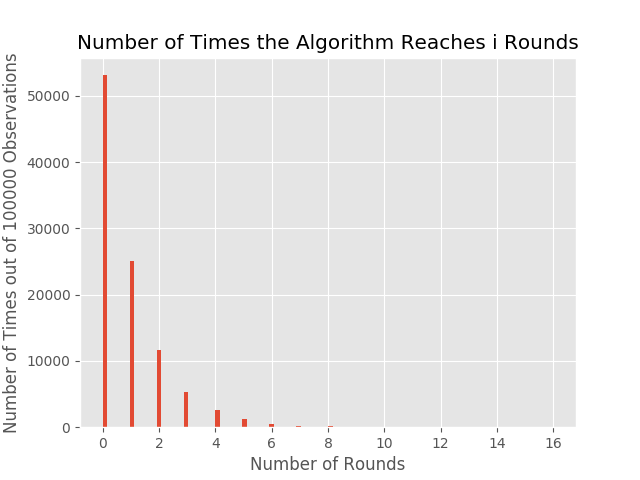
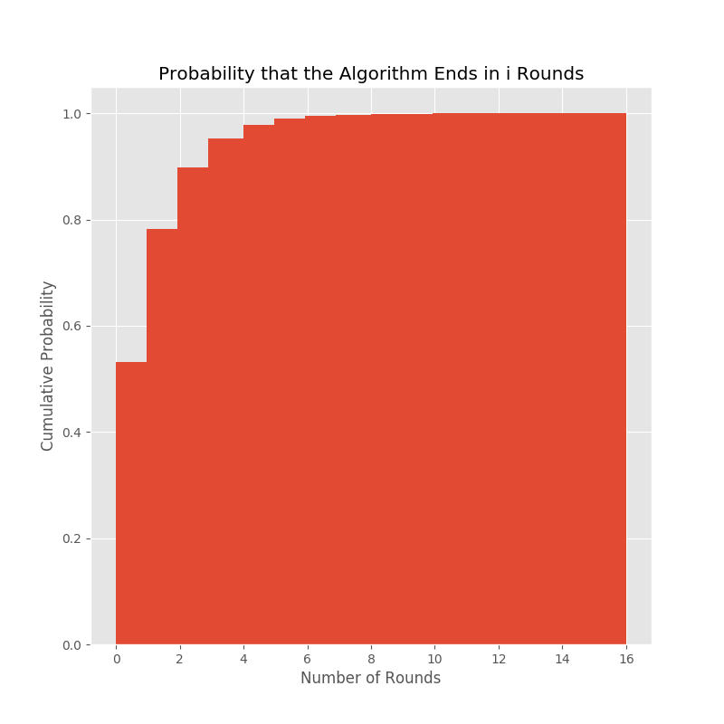
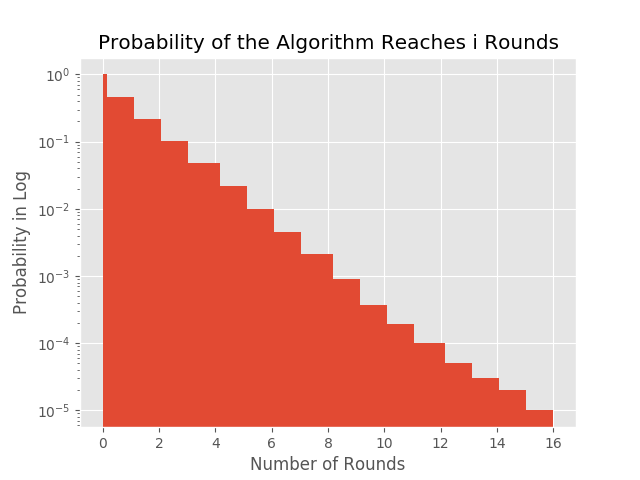

```python
def get_beacon_proposer_index(state: BeaconState) -> ValidatorIndex:
    """
    Return the beacon proposer index at the current slot.
    """
    epoch = get_current_epoch(state)
    committees_per_slot = get_committee_count(state, epoch) // SLOTS_PER_EPOCH
    offset = committees_per_slot * (state.slot % SLOTS_PER_EPOCH)
    shard = Shard((get_start_shard(state, epoch) + offset) % SHARD_COUNT)
    first_committee = get_crosslink_committee(state, epoch, shard)
    MAX_RANDOM_BYTE = 2**8 - 1
    seed = get_seed(state, epoch)
    i = 0
    while True:
        candidate_index = first_committee[(epoch + i) % len(first_committee)]
        random_byte = hash(seed + int_to_bytes(i // 32, length=8))[i % 32]
        effective_balance = state.validators[candidate_index].effective_balance
        if effective_balance * MAX_RANDOM_BYTE >= MAX_EFFECTIVE_BALANCE * random_byte:
            return ValidatorIndex(candidate_index)
        i += 1
```

Rearrange the last `if` condition, a validator's chance to be selected as proposer is propotional to their effective balance.

```
  effective_balance        random_byte
--------------------- >= ---------------
MAX_EFFECTIVE_BALANCE    MAX_RANDOM_BYTE
```

## Properties

- The validators assigned to the committee are already shuffled (see `get_crosslink_committee`). So candidate_index is fair to every validator.
- The validators then get challenged one by one in the `While` loop. A validator with higher effective balance is more likely to be chosen as the proposer. If a validator is not chosen, challenge the next one in the next round.
- A validator with `MAX_EFFECTIVE_BALANCE` would be chosen for sure.

## That While loop looks wild. How many rounds and how often would it usually reach?

- To get as many rounds as possible, set validators' balances as low as possible. 17 Ether is the lowest effective balance that validator not getting ejected.
- From figure 2, 90% of time, the algorithm ends within 5 rounds.
- From figure 3, it's so rare (10^(-5)) that the algorithm would reach 16 rounds.
- The expected number of rounds in the worst case is `0.88` round.